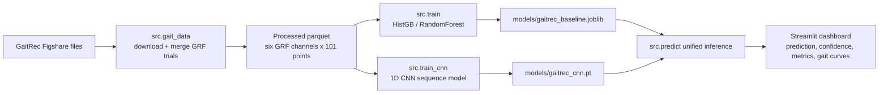

# Pathological Gait & Activity Recognition

This is a real-data MVP for detecting abnormal walking patterns outside the notebook environment. It uses **GaitRec** rather than synthetic data or HugaDB.

## Dataset Choice

Primary dataset: **GaitRec, a large-scale ground reaction force dataset of healthy and impaired gait**.

- Published in Scientific Data, 2020.
- Contains 75,732 bilateral walking trials.
- Includes 211 healthy controls and 2,084 patients with hip, knee, ankle, and calcaneus impairments.
- Hosted on Figshare collection under DOI `10.6084/m9.figshare.c.4788012`.

This is not a post-stroke hemiplegic IMU dataset; it is a clinically annotated pathological gait dataset. The MVP therefore focuses on abnormal gait recognition from real walking trials, with an explicit path to swap in wearable IMU datasets later.

## Quick Start

```bash
pip install -r requirements.txt
python -m src.train --download --rebuild --target target_binary --max-trials 5000
streamlit run app.py
```

For multi-class impairment recognition:

```bash
python -m src.train --download --rebuild --target target --max-trials 5000
```

For direct script execution, this also works:

```bash
python src/train.py --download --rebuild --target target_binary --max-trials 5000
```

## Colab GPU Path

1. Upload this folder to Google Drive or GitHub.
2. Open `notebooks/gaitrec_colab.ipynb` in Colab.
3. Select `Runtime > Change runtime type > GPU`.
4. Run the notebook to download GaitRec, build features, train a sampled baseline, and optionally train the 1D CNN.
5. Download the model artifact and run the dashboard locally:

```bash
streamlit run app.py
```

## Files

- `src/gait_data.py` downloads selected GaitRec files and builds the ML table.
- `src/train.py` trains a baseline classifier and writes metrics.
- `src/train_cnn.py` trains an optional 1D CNN on Colab/GPU.
- `src/predict.py` loads either `.joblib` sklearn artifacts or `.pt` CNN artifacts and predicts uploaded trials.
- `app.py` is the Streamlit dashboard.
- `notebooks/gaitrec_colab.ipynb` is the Colab entry point.

## Architecture



## Model

The default baseline uses a tree-based classifier over six processed GRF channels:

- vertical force left/right
- anterior-posterior force left/right
- medio-lateral force left/right

Each signal is already normalized to 101 stance-percent points in GaitRec, so one trial becomes a fixed-length feature vector.

For fast iteration, use `--max-trials 5000`. The split is subject-aware when `SUBJECT_ID` is available and metrics include `subject_overlap_count` so leakage is visible.

The optional CNN path preserves the six channels as a 1D time-series tensor. Install `requirements-cnn.txt` locally or run it in Colab, where PyTorch is usually already available:

```bash
python -m src.train_cnn --target target_binary --max-trials 5000 --epochs 12
```

The Streamlit dashboard can load either artifact:

- `models/gaitrec_baseline.joblib` for the sklearn pipeline
- `models/gaitrec_cnn.pt` for the 1D CNN pipeline

CNN inference requires PyTorch:

```bash
pip install -r requirements-cnn.txt
```

## Dashboard Behavior

The app no longer assumes a model exists. It can:

- run without a model and preview uploaded/local processed data
- switch explicitly between classical ML, 1D CNN, and custom model paths
- load `data/processed/gaitrec_features.parquet` automatically when present
- show model metrics from `models/gaitrec_metrics.json`
- compare baseline and CNN metrics when both metric files exist
- show confusion matrices from saved metrics
- plot average gait curves by ground truth or prediction
- plot left-vs-right trial curves for vertical, anterior-posterior, and medio-lateral GRF channels
- report missing feature columns clearly instead of crashing
- launch a one-click local bootstrap from the sidebar for download, build, and sampled baseline training

## Important Limitations

- This is decision support, not diagnosis.
- GaitRec is collected in a lab with force plates, not free-living phone or wearable sensors.
- Generalization to post-stroke hemiplegic gait requires an appropriate stroke or neurological-gait dataset and validation.
- No synthetic data is generated or used.
